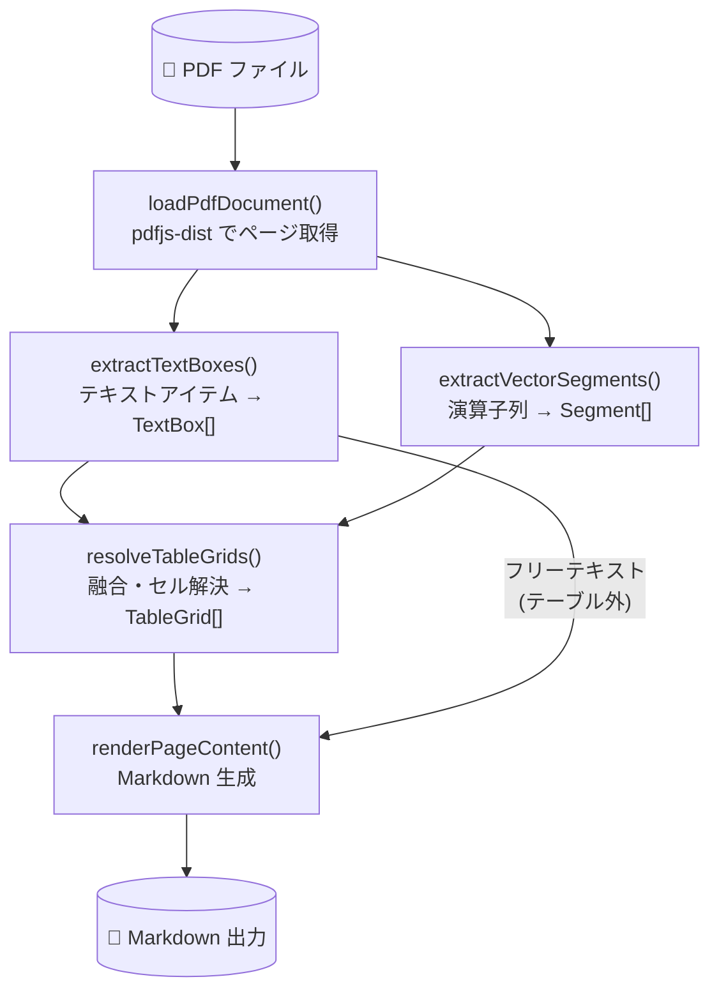
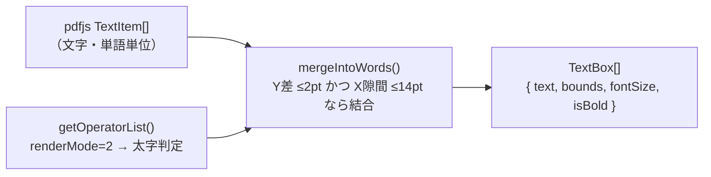
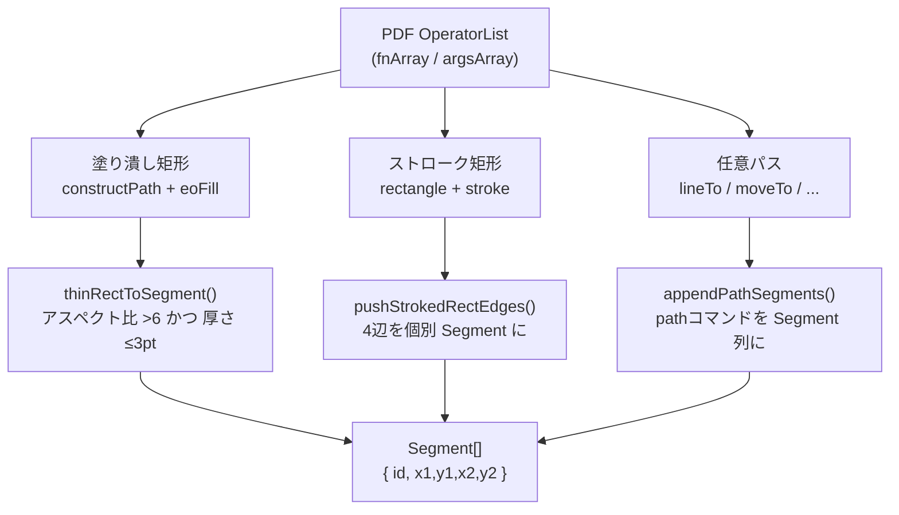
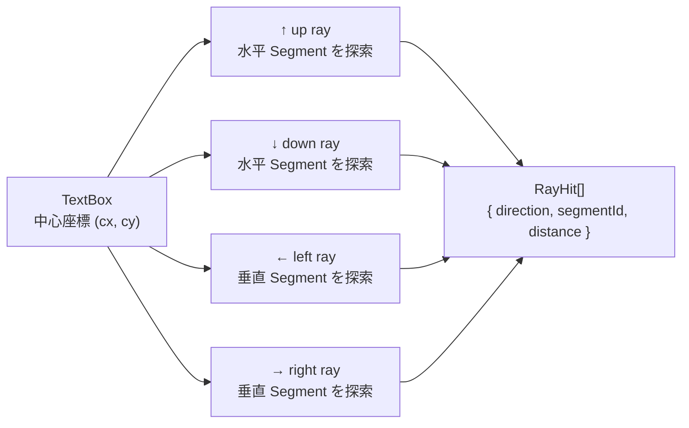
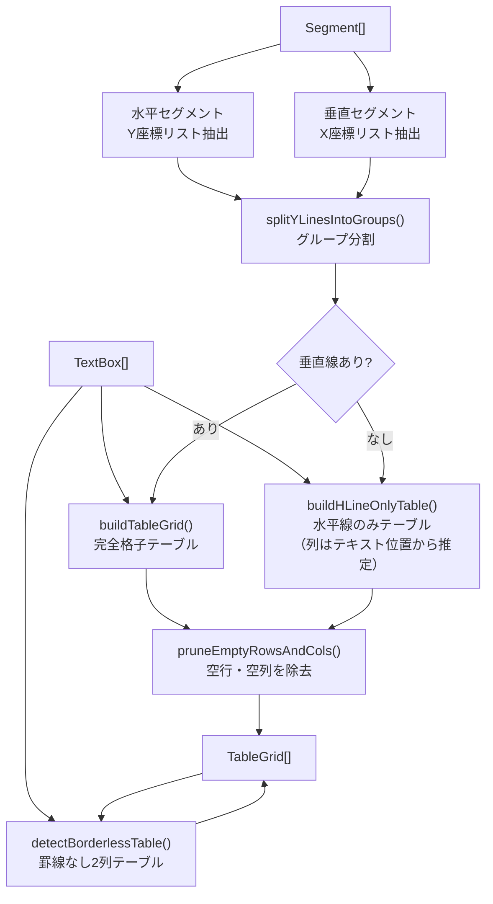
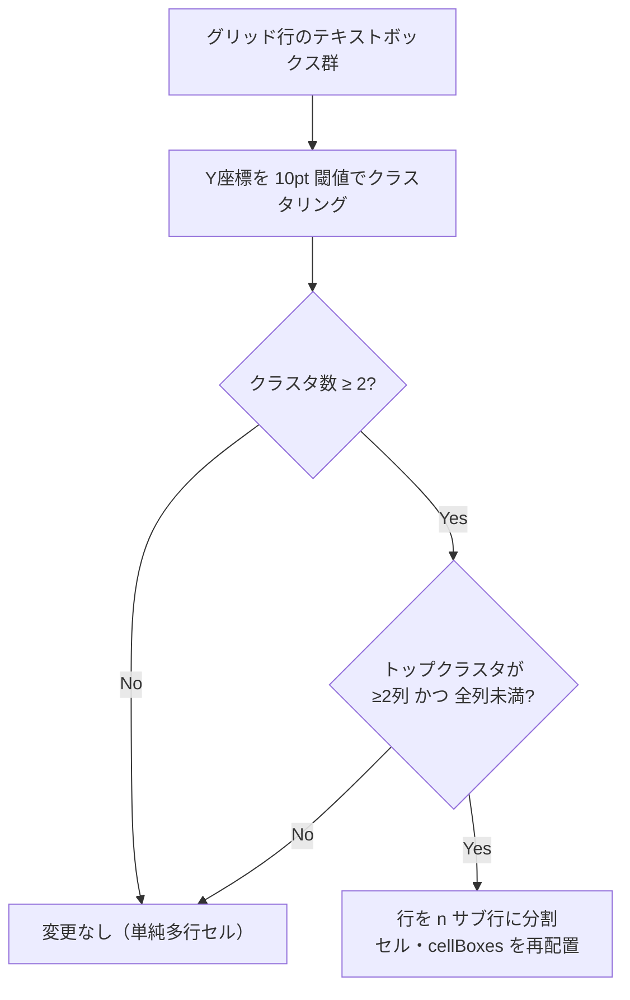
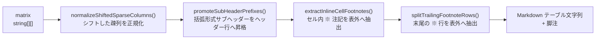
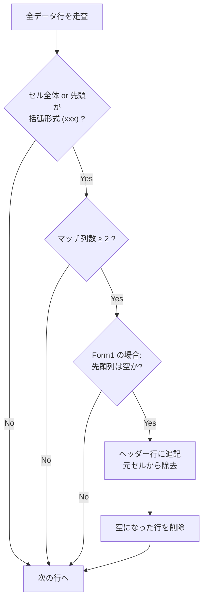
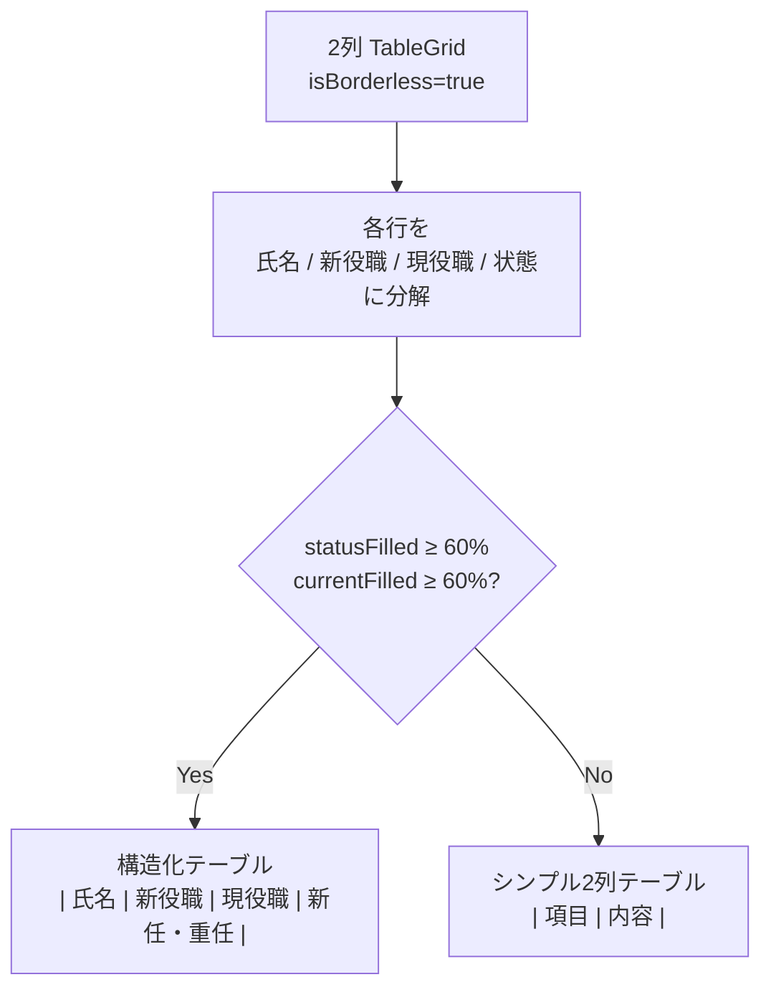
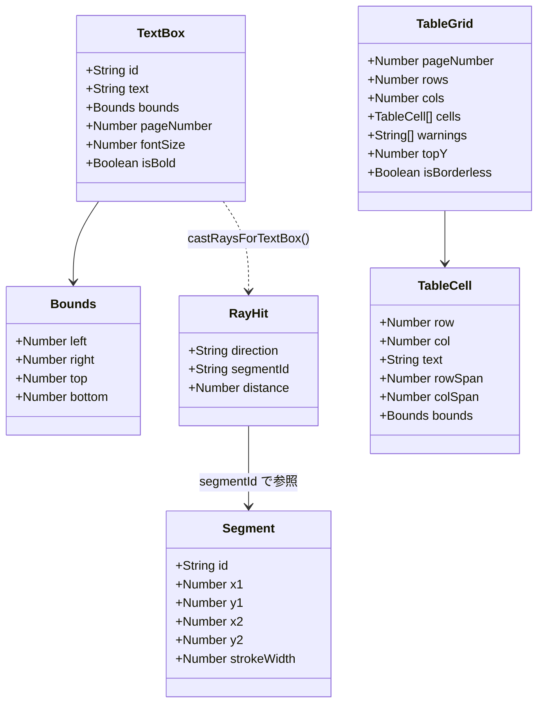

# アーキテクチャ・アルゴリズム解説

## 1. 使用ライブラリ

### ランタイム依存

| ライブラリ | バージョン | 役割 |
| --- | --- | --- |
| `pdfjs-dist` | ^4.10.38 | PDFパース。テキスト内容・演算子列・ページメタデータを取得 |
| `rbush` | ^4.0.1 | R木（空間インデックス）。将来の空間クエリ最適化用途で組み込み済み |

### 開発依存

| ライブラリ | 役割 |
| --- | --- |
| `typescript` | 静的型付け。strict mode で全ファイルを型チェック |
| `@typescript/native-preview` | Rust製 TypeScript コンパイラのプレビュー版（高速ビルド実験） |
| `vite` | バンドル・開発サーバ基盤 |
| `vitest` | ユニットテスト・スナップショットテスト |
| `oxlint` | Rust製高速 Lint。`--deny-warnings` で警告をエラー扱い |
| `tsx` | `ts-node` 代替。診断スクリプトの直接実行に使用 |

---

## 2. 全体データフロー



---

## 3. テキスト抽出（`textExtractor.ts`）

`pdfjs-dist` の `getTextContent()` が返す細粒度テキストアイテムを、
同一行・近接する要素同士でマージして `TextBox` に変換する。



**マージ閾値**

| パラメータ | 値 | 意味 |
| --- | --- | --- |
| `SAME_LINE_Y_TOLERANCE` | 2 pt | 同行と判定する Y 方向の許容誤差 |
| `MAX_MERGE_GAP` | 14 pt | 同一単語と判定する X 方向の最大隙間 |

---

## 4. ベクトル罫線抽出（`operatorExtractor.ts`）

PDF の描画命令列（演算子リスト）を走査し、罫線に相当する細い矩形・ストローク矩形・パスを `Segment` に変換する。



**フィルタ閾値**

| パラメータ | 値 | 意味 |
| --- | --- | --- |
| `LINE_ASPECT_THRESHOLD` | 6 | 横÷縦（または縦÷横）がこれ以上の矩形のみ線とみなす |
| `MIN_LENGTH` | 2 pt | セグメント最小長（装飾点を除外） |
| `MAX_THICKNESS` | 3 pt | セグメント最大太さ（塗りつぶし領域を除外） |

---

## 5. レイキャスト（`raycast.ts`）

各 `TextBox` の中心から上下左右に仮想的なレイを飛ばし、最も近い `Segment` への距離を測る。
セルへの割り当て信頼度スコアとして利用する。



`rayConfidence = hits.filter(h => h.segmentId !== null).length`  
→ 0 の場合はセグメント境界外とみなして配置をスキップ

---

## 6. テーブルグリッド解決（`cellResolver.ts`）

最も複雑な処理。ベクトルグリッドから `TableGrid` を構築する。

### 6-1. 全体フロー



### 6-2. Y行グループ分割

水平線の Y 座標群を「垂直セグメントの橋渡し」に基づいて独立テーブルに分割する。

```mermaid
flowchart TD
    YLIST["全 Y 座標（降順）"]
    ITER["隣接 Y ペアを順に処理"]
    BRIDGE{垂直 Segment が\n橋渡しするか?}
    RICH{橋渡し列数が\nMIN_RICH(=3) 以上?}
    SAME["同一グループに追加"]
    NEWSPLIT["新グループ開始"]

    YLIST --> ITER --> BRIDGE
    BRIDGE -->|"なし"| NEWSPLIT
    BRIDGE -->|"あり"| RICH
    RICH -->|"Rich→Sparse 変化"| NEWSPLIT
    RICH -->|"変化なし"| SAME
```

### 6-3. Y クラスタによるサブ行分割

同一グリッド行内に複数の Y クラスタが存在し、かつそれが **一部の列のみ** に集中している場合、行を実際のサブ行に分割する。これは純粋に位置ベースで、テキスト内容に依存しない。



**例：** 年度表記を含む表

```
┌──────────────────┬──────────────────┬──────────────────┐
│ 取引の種類        │ 同社に対する売上高│ 売上高全体に占める│
│                  │ ← Y=710 (高)     │ ← Y=710 (高)     │  ← ヘッダー行
├──────────────────┼──────────────────┼──────────────────┤
│                  │ (2026年2月期)     │ (2026年2月期)    │  ← Y=694 (高)
│ アフィリエイト   │ 121,454 千円      │ ※3.4%           │  ← Y=678 (低)
└──────────────────┴──────────────────┴──────────────────┘
```

col1・col2 は Y=694 と Y=678 の2クラスタ → 行を分割 → (2026年2月期) がヘッダーに昇格

---

## 7. Markdown レンダリング（`render.ts`）

### 7-1. 通常テーブル変換パイプライン



### 7-2. ヘッダー昇格の判定ロジック（`promoteSubHeaderPrefixes`）



### 7-3. 罫線なし2列テーブルのヒューリスティック（`renderBorderlessTableToMarkdown`）

役員名簿パターン（氏名 + 役職 + 現職 + 新任/重任）を検出して構造化テーブルに変換する。



---

## 8. データ型の関係図




## 8. プラグイン機構

テキストとテーブルのマークダウンへのレンダリングは、柔軟に拡張できるようにプラグイン化されています。

1. **TextLinePlugin**:
   フリーテキストの各行（1件のパラグラフ）に対して呼ばれるプラグイン。フォントサイズやテキストの内容から `# ` や `## ` などの見出し用の接頭辞（Prefix）を決定します。
2. **PageBlockPlugin**:
   改行区切りされたブロック（フリーテキストやテーブル）の配列全体を受け取り、前後の関連ブロックを結合したり、不要なブロック（ページ番号など）を削るような事後処理（Post Process）を行います。
3. **BorderlessTablePlugin**:
   完全に罫線に囲まれていない構造（段組みなど特定のパターン）を検出した際に、通常の Markdown テーブルではなく、リスト形式などカスタムのテキスト化を適用するためのプラグインです。


## 8. プラグイン機構

テキストとテーブルのマークダウンへのレンダリングは、柔軟に拡張できるようにプラグイン化されています。

1. **TextLinePlugin**:
   フリーテキストの各行（1件のパラグラフ）に対して呼ばれるプラグイン。フォントサイズやテキストの内容から `# ` や `## ` などの見出し用の接頭辞（Prefix）を決定します。
2. **PageBlockPlugin**:
   改行区切りされたブロック（フリーテキストやテーブル）の配列全体を受け取り、前後の関連ブロックを結合したり、不要なブロック（ページ番号など）を削るような事後処理（Post Process）を行います。
3. **BorderlessTablePlugin**:
   完全に罫線に囲まれていない構造（段組みなど特定のパターン）を検出した際に、通常の Markdown テーブルではなく、リスト形式などカスタムのテキスト化を適用するためのプラグインです。
